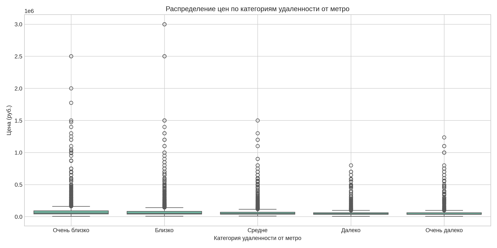
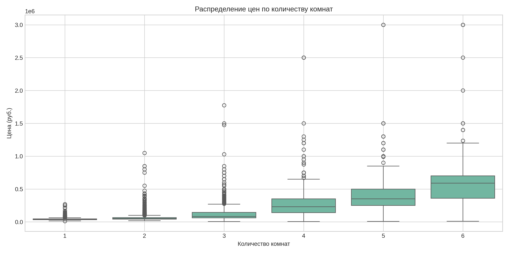
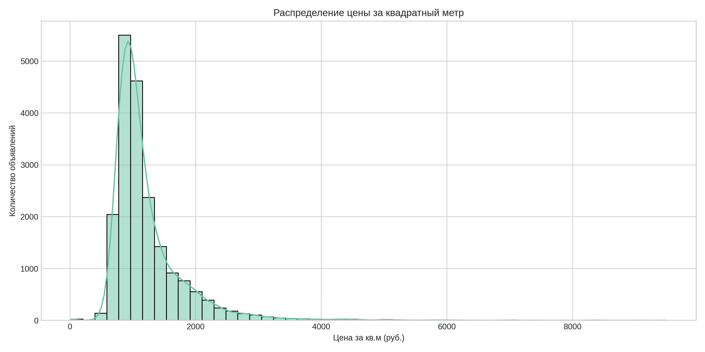
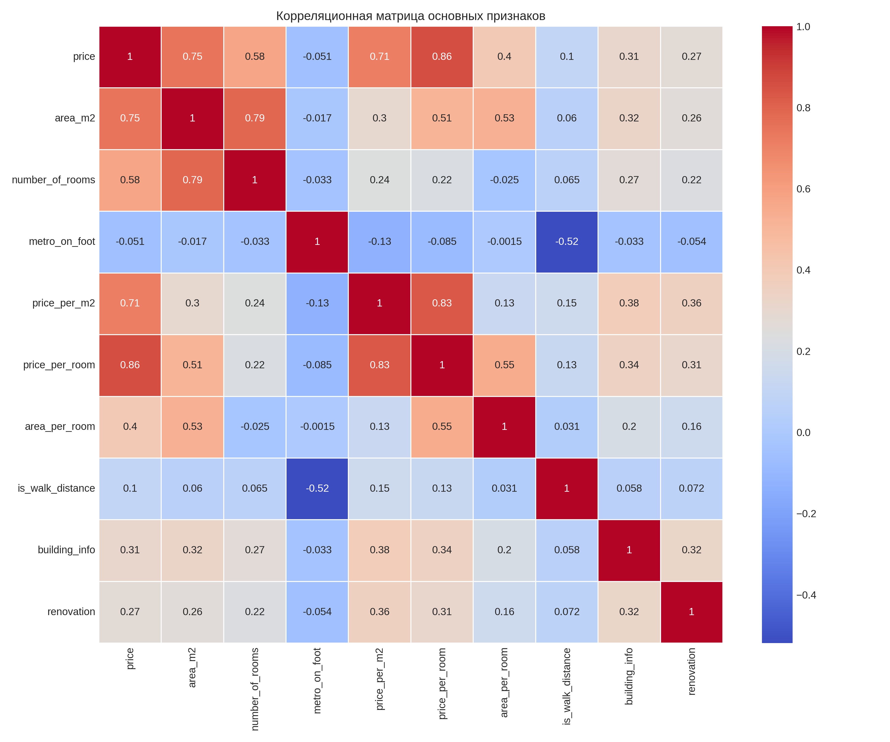

# Проект предсказания стоимости аренды квартир

## Описание проекта
Данный проект выполняется для компании **Alyona Ivanovna Real Estate Agency (AI REA Ltd)** - международного сервиса по продаже и аренде жилой недвижимости.

### Задача проекта
Наша команда работает над подготовкой данных для обучения модели машинного обучения, которая будет предсказывать стоимость аренды квартир в Москве. Конечная цель - создать модель, которая будет выдавать предсказания с метрикой MAPE не более 30% (улучшение с текущих 50%).

### Этапы работы
1. **Релиз 1.0** ✅ - Разведочный анализ данных (EDA)
2. **Релиз 2.0** ✅ - Очистка данных от пропусков
3. **Релиз 3.0** ✅ - Инженерия признаков (Feature Engineering)

## Состав команды
- Ступак Александр
- Никита Тимофеев

## Текущий релиз (3.0)
В рамках третьего релиза мы провели инженерию признаков (Feature Engineering):

### Созданные признаки:
1. **Признаки на основе цены**:
   - `price_per_m2` - цена за квадратный метр
   - `price_per_room` - цена за комнату

2. **Признаки на основе метро**:
   - `metro_category` - категории удаленности от метро (0-4)
   - `is_walk_distance` - бинарный признак (пешая доступность ≤ 10 минут)

3. **Признаки на основе площади**:
   - `is_small_area` - бинарный признак для небольших квартир
   - `is_large_area` - бинарный признак для больших квартир
   - `area_per_room` - площадь на комнату

4. **Категориальные признаки**:
   - `price_category` - категория цены (0-3)

5. **Комбинированные признаки**:
   - `building_renovation` - комбинация типа здания и ремонта
   - `metro_building` - комбинация близости к метро и типа здания

### Основные выводы:
1. **Связь цены и удаленности от метро**: Чем ближе квартира к метро, тем она дороже.
   

2. **Зависимость цены от количества комнат**: С увеличением количества комнат растет и стоимость аренды.
   

3. **Распределение цены за квадратный метр**: Большинство квартир имеют среднерыночную стоимость за кв.м.
   

4. **Корреляция признаков**: Наиболее сильно с ценой коррелируют площадь квартиры и количество комнат.
   

### Результаты:
- Создан набор данных без пропусков и дубликатов
- Все признаки приведены к числовому типу (int или float)
- Добавлено 10 новых информативных признаков для улучшения качества модели
- Результаты сохранены в файл `SOLYaNKA.csv`

## Предыдущие релизы
### Релиз 2.0
В рамках второго релиза мы провели очистку данных от пропусков:
- Переименовали колонки на английский язык для соответствия стандартам
- Обработали пропущенные значения во всех колонках
- Стандартизировали форматы данных
- Сократили набор данных до 8 ключевых признаков:
  - id_listing: ID объявления
  - number_of_rooms: Количество комнат
  - metro_on_foot: Время до метро пешком (в минутах)
  - area_m2: Площадь квартиры (в м²)
  - building_info: Тип дома (категориальный признак)
  - price: Цена аренды квартиры
  - renovation: Тип ремонта (категориальный признак)
  - bathroom: Тип санузла (категориальный признак)

Результаты обработки данных представлены в файлах:
- **preprocessing.ipynb**: процесс очистки и преобразования данных
- **edited_data.csv**: очищенный набор данных без пропусков

### Релиз 1.0
В рамках первого релиза мы провели разведочный анализ данных:
- Изучили структуру и содержание датасета
- Проанализировали распределения основных показателей
- Выявили закономерности и зависимости
- Определили направления для дальнейшей обработки данных

Результаты анализа представлены в файле **EDA.html**
